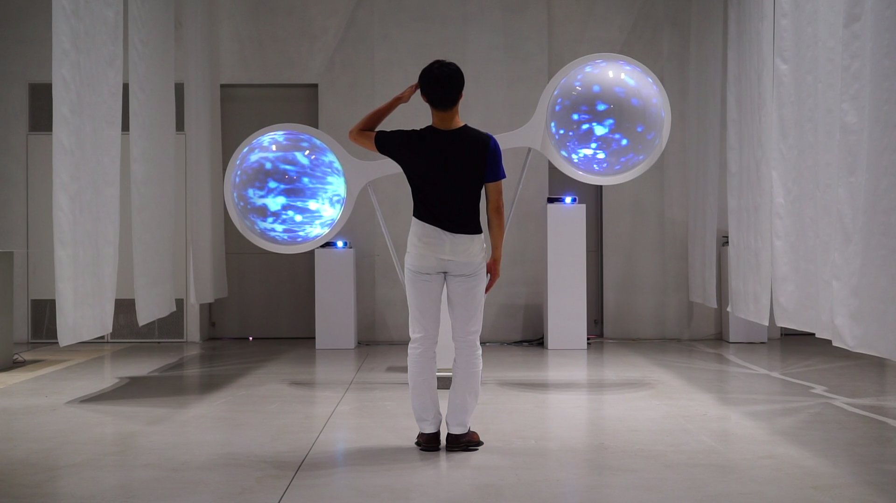
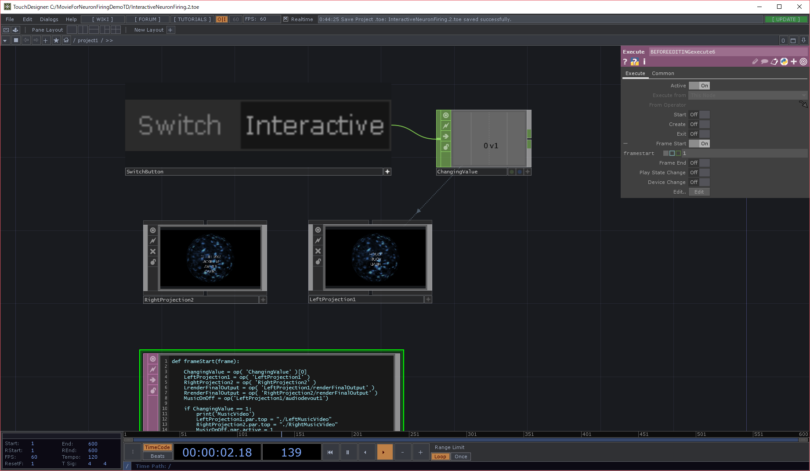
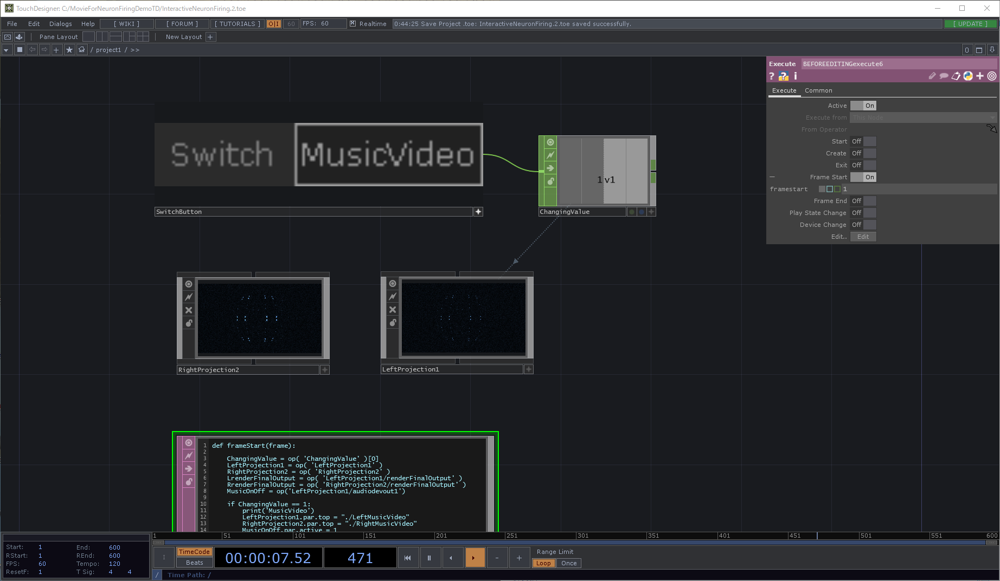
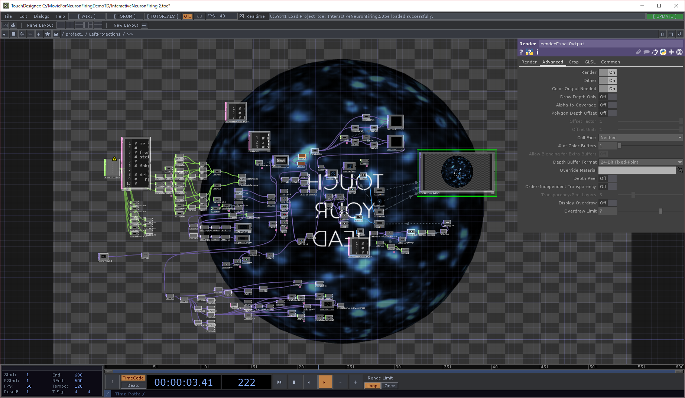

# NeuronFiringDemoTD

## 操作画面

## プレイ動画
[Click here](https://vimeo.com/235548118)

## 概要
脳の神経細胞を人工的に生成する研究室とのコラボレーションプロジェクトで神経細胞の情報伝達の仕組みを体験して直感的に理解するインタラクティブコンテンツをTouchDesignerを利用して作成した。
動画の元素材として
[Click here](https://www.youtube.com/watch?v=yy994HpFudc)
[Click here](https://www.youtube.com/watch?v=il5KvMfKLq0)
を利用させていただいた。
Brandon_lightのフォントをUI表示に利用している。

## 制作進捗
1. kinectを用いて最もkinectから近い距離にいる人をプレイヤーとして設定する(TouchDesignerではkinectCHOPで最大6人の骨格を判定できる)。
2. プレイヤーは手を頭に近づけることによって動画の再生を切り替えることができる。
3. 左手が頭に触れると左側の神経細胞群が発光しその反応が右側の神経細胞群に伝わるようになっている。右手が触れた場合はその逆となる。
4. スイッチ一つでインタラクティブモードとノンインタラクティブ動画モードを切り替えられるようにした。これによって展覧会時に人の流れを潤滑にしたいときはノンインタラクティブ動画モードにしておき、一巡した後のお酒の場ではインタラクティブモードを楽しんでもらうといった使い分けができる。
5. UI表示場面から発光エフェクトが再生されて再びUI表示に戻る際に滑らかに文字が表示されるように調整をした（いきなり白い文字が現れるのではなく必ずじわじわと透明度が下がるようなフェード処理）。

## 実行データ
TouchDesignerで制作したtoeファイルが実行ファイルを兼ねるのでTouchDesigner099が入っていないと動きません。

## 制作環境/プレイ環境
MovieForNeuronFiringDemoTDフォルダをCドライブ直下に配置しtoeファイルをTouchDesigner099にて開いてください。
プロジェクターで投影する場合は(./project1/RightProjection2)と(./project1/LeftProjection1)をそれぞれ右クリックしViewを押して接続した二台の同じ型番のプロジェクターにそれぞれのウィンドウをフルスクリーン表示してください。

### PC

OS : windows10

### ソフトウェア

TouchDesigner099
Kinect Studio v2.0

### 周辺機器

KinectV2

## 謝辞
プロジェクションされるハードを制作してくれた現RCA-IISデザインラボスタッフの[Christian](https://www.christianfelsner.com/)に感謝します。
